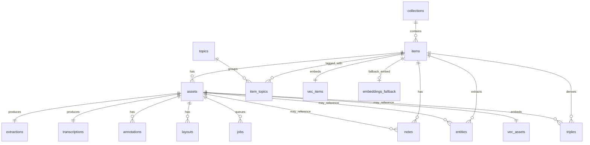

# SQLite de EntropIA

Documentación de la base SQLite activa de EntropIA, cómo inspeccionarla y cuál es su esquema actual.

## Ubicación de la base activa

La base activa detectada para la app Tauri actual es:

```text
C:\Users\agusn\AppData\Roaming\com.entropia.desktop\entropia.sqlite
```

También existe una base legacy de migración:

```text
C:\Users\agusn\AppData\Roaming\com.entropia.app\entropia.sqlite
```

## De dónde sale esta ruta

- `apps/desktop/src-tauri/tauri.conf.json`
  - `identifier`: `com.entropia.desktop`
  - `productName`: `EntropIA`
- `apps/desktop/src-tauri/src/lib.rs`
  - usa `app.path().app_data_dir()`
  - crea/abre `entropia.sqlite` dentro de ese directorio

## Cómo abrir la base

Si tenés `sqlite3` instalado:

```powershell
sqlite3 "C:\Users\agusn\AppData\Roaming\com.entropia.desktop\entropia.sqlite"
```

## Comandos básicos de inspección

Dentro de `sqlite3`:

```sql
.tables
.schema
.schema assets
PRAGMA table_info(assets);
```

## Contrato FTS5 canónico

El índice `fts_items` es una tabla FTS5 **contentless**. El contrato obligatorio es:

- `fts_items.rowid = items.rowid`
- `item_id` es solo un payload auxiliar, NO la identidad del índice
- todos los inserts al índice deben escribir `rowid` explícito
- los deletes por `item_id` son incompatibles con este diseño y NO se usan
- cuando hay dudas de drift, el procedimiento seguro es `delete-all + rebuild`

En la base actual esto se corrige con:

- migración baseline `0004_fts5.sql` usando `rowid` explícito
- migración correctiva `0018_fts_rowid_canonical.sql` para bases existentes
- script manual `scripts/rebuild_fts.sql` para rebuild operativo

## Script SQL para listar tablas

```sql
SELECT name
FROM sqlite_master
WHERE type = 'table'
  AND name NOT LIKE 'sqlite_%'
ORDER BY name;
```

## Script SQL para listar tabla -> columnas

```sql
SELECT
  m.name AS tabla,
  p.cid AS col_id,
  p.name AS columna,
  p.type AS tipo,
  p."notnull" AS not_null,
  p.pk AS es_pk
FROM sqlite_master m
JOIN pragma_table_info(m.name) p
WHERE m.type = 'table'
  AND m.name NOT LIKE 'sqlite_%'
ORDER BY m.name, p.cid;
```

## Script SQL completo para inspección rápida

```sql
.tables

SELECT name
FROM sqlite_master
WHERE type = 'table'
  AND name NOT LIKE 'sqlite_%'
ORDER BY name;

PRAGMA table_info(_migrations);
PRAGMA table_info(annotations);
PRAGMA table_info(app_settings);
PRAGMA table_info(assets);
PRAGMA table_info(collections);
PRAGMA table_info(embeddings_fallback);
PRAGMA table_info(entities);
PRAGMA table_info(extractions);
PRAGMA table_info(fts_items);
PRAGMA table_info(fts_items_config);
PRAGMA table_info(fts_items_data);
PRAGMA table_info(fts_items_docsize);
PRAGMA table_info(fts_items_idx);
PRAGMA table_info(item_topics);
PRAGMA table_info(items);
PRAGMA table_info(jobs);
PRAGMA table_info(layouts);
PRAGMA table_info(llm_results);
PRAGMA table_info(notes);
PRAGMA table_info(topics);
PRAGMA table_info(transcriptions);
PRAGMA table_info(triples);
PRAGMA table_info(vec_assets);
PRAGMA table_info(vec_items);
```

## Clasificación de tablas

### Tablas de negocio

- `collections`
- `items`
- `assets`
- `notes`
- `topics`
- `item_topics`
- `annotations`
- `entities`
- `triples`
- `jobs`
- `extractions`
- `transcriptions`
- `layouts`
- `llm_results`
- `app_settings`

### Tablas técnicas / infraestructura

- `_migrations`
- `embeddings_fallback`
- `vec_items`
- `vec_assets`

### Tablas internas de FTS5

- `fts_items`
- `fts_items_config`
- `fts_items_data`
- `fts_items_docsize`
- `fts_items_idx`

> Nota: `fts_items_*` pertenece al índice full-text y no representa entidades de negocio normales.

> Nota importante: en EntropIA la identidad real del índice NO es `fts_items.item_id`, sino `fts_items.rowid` alineado con `items.rowid`.

## Árbol: base -> tablas -> variables

### `entropia.sqlite`

#### `_migrations`
- `id`
- `name`
- `applied_at`

#### `annotations`
- `id`
- `asset_id`
- `page`
- `kind`
- `color`
- `x`
- `y`
- `width`
- `height`
- `created_at`
- `updated_at`

#### `app_settings`
- `key`
- `value`

#### `assets`
- `id`
- `item_id`
- `path`
- `type`
- `size`
- `created_at`
- `sort_index`

#### `collections`
- `id`
- `name`
- `description`
- `created_at`
- `updated_at`

#### `embeddings_fallback`
- `item_id`
- `embedding`

#### `entities`
- `id`
- `item_id`
- `entity_type`
- `value`
- `start_offset`
- `end_offset`
- `confidence`
- `source`
- `model_name`
- `created_at`
- `latitude`
- `longitude`
- `geo_status`
- `asset_id`

#### `extractions`
- `id`
- `asset_id`
- `text_content`
- `method`
- `confidence`
- `created_at`

#### `fts_items`
- `item_id`
- `title`
- `metadata`
- `extracted_text`

#### `fts_items_config`
- `k`
- `v`

#### `fts_items_data`
- `id`
- `block`

#### `fts_items_docsize`
- `id`
- `sz`

#### `fts_items_idx`
- `segid`
- `term`
- `pgno`

#### `item_topics`
- `id`
- `item_id`
- `topic_id`
- `created_at`

#### `items`
- `id`
- `title`
- `collection_id`
- `metadata`
- `created_at`
- `updated_at`

#### `jobs`
- `id`
- `type`
- `status`
- `asset_id`
- `result`
- `error`
- `created_at`
- `updated_at`

#### `layouts`
- `id`
- `asset_id`
- `regions`
- `model`
- `image_width`
- `image_height`
- `created_at`

#### `llm_results`
- `id`
- `target_id`
- `target_type`
- `job_type`
- `result`
- `created_at`

#### `notes`
- `id`
- `item_id`
- `content`
- `created_at`
- `updated_at`
- `asset_id`

#### `topics`
- `id`
- `name`
- `created_at`

#### `transcriptions`
- `id`
- `asset_id`
- `text_content`
- `language`
- `duration_ms`
- `model`
- `segments`
- `confidence`
- `created_at`

#### `triples`
- `id`
- `item_id`
- `subject`
- `predicate`
- `object`
- `created_at`
- `asset_id`

#### `vec_assets`
- `asset_id`
- `item_id`
- `embedding`

#### `vec_items`
- `item_id`
- `embedding`

## Relaciones conceptuales

```text
collections -> items -> assets -> (extractions, transcriptions, layouts, annotations)
items -> (notes, entities, triples, item_topics)
item_topics -> topics
```

## Mini ERD ASCII

```text
collections
  |
  | 1:N
  v
items
  |
  | 1:N
  v
assets
  ├── 1:1 -> extractions
  ├── 1:1 -> transcriptions
  ├── 1:N -> annotations
  └── 1:N -> layouts

items
  ├── 1:N -> notes
  ├── 1:N -> entities
  ├── 1:N -> triples
  └── N:M -> topics
            via item_topics

assets
  ├── 1:N -> jobs
  ├── 0..1 -> notes
  ├── 0..N -> entities
  └── 0..N -> triples

items
  ├── 1:1 -> vec_items
  └── 0..1 -> embeddings_fallback

assets
  └── 1:1 -> vec_assets
```

### Lectura rápida del ERD

- una `collection` agrupa muchos `items`
- un `item` puede tener muchos `assets`
- un `asset` concentra procesamiento derivado: OCR, transcripción, layout, anotaciones y jobs
- un `item` concentra conocimiento semántico: notas, entidades, triples y tópicos
- la relación entre `items` y `topics` es muchos-a-muchos mediante `item_topics`
- las tablas `vec_items`, `vec_assets` y `embeddings_fallback` soportan búsqueda/vectorización

## PK/FK por tabla

### `_migrations`
- PK: `id`
- FK: ninguna

### `annotations`
- PK: `id`
- FK:
  - `asset_id -> assets.id`

### `app_settings`
- PK: `key`
- FK: ninguna

### `assets`
- PK: `id`
- FK:
  - `item_id -> items.id`

### `collections`
- PK: `id`
- FK: ninguna

### `embeddings_fallback`
- PK: `item_id`
- FK conceptual:
  - `item_id -> items.id`

### `entities`
- PK: `id`
- FK conceptuales:
  - `item_id -> items.id`
  - `asset_id -> assets.id`

### `extractions`
- PK: `id`
- FK:
  - `asset_id -> assets.id`

### `fts_items`
- PK: virtual FTS5, sin PK de negocio clásica
- FK conceptual:
  - `item_id -> items.id`

### `fts_items_config`
- PK: `k`
- FK: ninguna

### `fts_items_data`
- PK: `id`
- FK: interna FTS5

### `fts_items_docsize`
- PK: `id`
- FK: interna FTS5

### `fts_items_idx`
- PK compuesta: `segid`, `term`
- FK: interna FTS5

### `item_topics`
- PK: `id`
- FK:
  - `item_id -> items.id`
  - `topic_id -> topics.id`

### `items`
- PK: `id`
- FK:
  - `collection_id -> collections.id`

### `jobs`
- PK: `id`
- FK conceptual:
  - `asset_id -> assets.id`

### `layouts`
- PK: `id`
- FK:
  - `asset_id -> assets.id`

### `llm_results`
- PK: `id`
- FK conceptual tipada:
  - `target_type='asset' -> target_id -> assets.id`
  - `target_type='item' -> target_id -> items.id`
  - `target_type='collection' -> target_id -> collections.id`
  - `target_type='unknown'` reservado para filas legacy no inferibles

### `notes`
- PK: `id`
- FK conceptuales:
  - `item_id -> items.id`
  - `asset_id -> assets.id`

### `topics`
- PK: `id`
- FK: ninguna

### `transcriptions`
- PK: `id`
- FK:
  - `asset_id -> assets.id`

### `triples`
- PK: `id`
- FK conceptuales:
  - `item_id -> items.id`
  - `asset_id -> assets.id`

### `vec_assets`
- PK: `asset_id`
- FK conceptual:
  - `asset_id -> assets.id`
  - `item_id -> items.id`

### `vec_items`
- PK: `item_id`
- FK conceptual:
  - `item_id -> items.id`

## Mermaid ERD



### Nota sobre FK reales vs conceptuales

- Algunas relaciones están respaldadas por foreign keys reales en SQLite.
- Otras aparecen por convención de esquema y uso en código, aunque no siempre estén reforzadas con constraint explícita.
- Esto importa MUCHO: una cosa es el modelo lógico y otra el enforcement físico de SQLite.

## Índices y constraints reales observados

### Constraints destacadas por tabla

#### `_migrations`
- `PRIMARY KEY AUTOINCREMENT (id)`
- `UNIQUE (name)`
- `NOT NULL`: `name`, `applied_at`

#### `annotations`
- `PRIMARY KEY (id)`
- `FOREIGN KEY (asset_id) REFERENCES assets(id) ON DELETE CASCADE`
- `CHECK kind IN ('rectangle', 'underline')`
- `NOT NULL` en casi todas las columnas operativas

#### `app_settings`
- `PRIMARY KEY (key)`
- `NOT NULL (value)`

#### `assets`
- `PRIMARY KEY (id)`
- `FOREIGN KEY (item_id) REFERENCES items(id)`
- `NOT NULL`: `item_id`, `path`, `type`, `created_at`, `sort_index`
- `DEFAULT sort_index = 0`

#### `collections`
- `PRIMARY KEY (id)`
- `NOT NULL`: `name`, `created_at`, `updated_at`

#### `embeddings_fallback`
- `PRIMARY KEY (item_id)`
- `NOT NULL (embedding)`

#### `entities`
- `PRIMARY KEY (id)`
- `FOREIGN KEY (item_id) REFERENCES items(id) ON DELETE CASCADE`
- `CHECK entity_type IN ('person','place','date','institution','organization','misc','custom')`
- `DEFAULT start_offset = 0`
- `DEFAULT end_offset = 0`
- `DEFAULT confidence = 1.0`
- `DEFAULT created_at = strftime('%s', 'now')`
- `DEFAULT geo_status = 'pending'`

#### `extractions`
- `PRIMARY KEY (id)`
- `FOREIGN KEY (asset_id) REFERENCES assets(id) ON DELETE CASCADE`
- `UNIQUE INDEX idx_extractions_asset_id_unique ON (asset_id)`
- `NOT NULL`: `asset_id`, `text_content`, `method`, `created_at`

#### `fts_items`
- tabla virtual `FTS5`
- `tokenize='unicode61 remove_diacritics 1'`
- `content=''` (contentless FTS)

#### `item_topics`
- `PRIMARY KEY (id)`
- `FOREIGN KEY (item_id) REFERENCES items(id) ON DELETE CASCADE`
- `FOREIGN KEY (topic_id) REFERENCES topics(id) ON DELETE CASCADE`
- `UNIQUE INDEX idx_item_topics_item_topic ON (item_id, topic_id)`

#### `items`
- `PRIMARY KEY (id)`
- `FOREIGN KEY (collection_id) REFERENCES collections(id)`
- `GENERATED ALWAYS STORED`: `search_text`
- `search_text = COALESCE(title, '') || ' ' || COALESCE(json(metadata), '')`

#### `jobs`
- `PRIMARY KEY (id)`
- `FOREIGN KEY (asset_id) REFERENCES assets(id)`
- `DEFAULT status = 'pending'`

#### `layouts`
- `PRIMARY KEY (id)`
- `FOREIGN KEY (asset_id) REFERENCES assets(id) ON DELETE CASCADE`

#### `llm_results`
- `PRIMARY KEY (id)`
- `target_type CHECK ('asset' | 'item' | 'collection' | 'unknown')`
- sin FK física sobre `target_id`, pero con scope explícito por `target_type`

#### `notes`
- `PRIMARY KEY (id)`
- `FOREIGN KEY (item_id) REFERENCES items(id)`
- `asset_id` existe pero sin FK física explícita en el schema observado

#### `topics`
- `PRIMARY KEY (id)`
- `UNIQUE (name)`

#### `transcriptions`
- `PRIMARY KEY (id)`
- `FOREIGN KEY (asset_id) REFERENCES assets(id) ON DELETE CASCADE`
- `UNIQUE INDEX idx_transcriptions_asset_id_unique ON (asset_id)`

#### `triples`
- `PRIMARY KEY (id)`
- `FOREIGN KEY (item_id) REFERENCES items(id) ON DELETE CASCADE`
- `DEFAULT created_at = strftime('%s', 'now')`
- `asset_id` existe pero sin FK física explícita en el schema observado

#### `vec_assets`
- `PRIMARY KEY (asset_id)`
- `item_id NOT NULL`
- sin FKs físicas explícitas en el schema observado

#### `vec_items`
- `PRIMARY KEY (item_id)`
- sin FKs físicas explícitas en el schema observado

### Índices observados

- `annotations_asset_id_idx` → `annotations(asset_id)`
- `annotations_asset_page_idx` → `annotations(asset_id, page)`
- `idx_assets_item` → `assets(item_id)`
- `idx_assets_item_sort` → `assets(item_id, sort_index)`
- `idx_entities_asset_id` → `entities(asset_id)`
- `idx_entities_geo_status` → `entities(geo_status)`
- `idx_entities_item_id` → `entities(item_id)`
- `idx_entities_type` → `entities(entity_type)`
- `idx_extractions_asset_id` → `extractions(asset_id)`
- `idx_extractions_asset_id_unique` → `extractions(asset_id)` **UNIQUE**
- `idx_item_topics_item_topic` → `item_topics(item_id, topic_id)` **UNIQUE**
- `idx_item_topics_topic_id` → `item_topics(topic_id)`
- `idx_items_collection` → `items(collection_id)`
- `idx_items_search` → `items(search_text)`
- `idx_jobs_asset_id` → `jobs(asset_id)`
- `idx_jobs_status` → `jobs(status)`
- `idx_layouts_asset_id` → `layouts(asset_id)`
- `idx_llm_results_target` → `llm_results(target_id)`
- `idx_llm_results_target_typed` → `llm_results(target_type, target_id, job_type)`
- `idx_notes_asset_id` → `notes(asset_id)`
- `idx_notes_item` → `notes(item_id)`
- `idx_transcriptions_asset_id` → `transcriptions(asset_id)`
- `idx_transcriptions_asset_id_unique` → `transcriptions(asset_id)` **UNIQUE**
- `idx_triples_asset_id` → `triples(asset_id)`
- `idx_vec_assets_item_id` → `vec_assets(item_id)`
- `triples_item_id_idx` → `triples(item_id)`

### Implicancias arquitectónicas

- `extractions` y `transcriptions` están modeladas efectivamente como **1:1 por asset** por sus índices únicos sobre `asset_id`.
- `item_topics` evita duplicados lógicos con índice único `(item_id, topic_id)`.
- `items.search_text` es una columna generada pensada para acelerar búsqueda/filtrado.
- `notes.asset_id`, `triples.asset_id`, `entities.asset_id`, `vec_*` y `llm_results.target_id` no siempre tienen FK física, así que parte de la integridad depende de la app; en `llm_results` el `target_type` reduce ambigüedad y permite cleanup explícito.

## Query SQL de relaciones conceptuales

```sql
SELECT 'items -> collections' AS relacion, 'items.collection_id = collections.id'
UNION ALL
SELECT 'assets -> items', 'assets.item_id = items.id'
UNION ALL
SELECT 'notes -> items', 'notes.item_id = items.id'
UNION ALL
SELECT 'notes -> assets', 'notes.asset_id = assets.id'
UNION ALL
SELECT 'item_topics -> items', 'item_topics.item_id = items.id'
UNION ALL
SELECT 'item_topics -> topics', 'item_topics.topic_id = topics.id'
UNION ALL
SELECT 'annotations -> assets', 'annotations.asset_id = assets.id'
UNION ALL
SELECT 'entities -> items', 'entities.item_id = items.id'
UNION ALL
SELECT 'entities -> assets', 'entities.asset_id = assets.id'
UNION ALL
SELECT 'triples -> items', 'triples.item_id = items.id'
UNION ALL
SELECT 'triples -> assets', 'triples.asset_id = assets.id'
UNION ALL
SELECT 'extractions -> assets', 'extractions.asset_id = assets.id'
UNION ALL
SELECT 'transcriptions -> assets', 'transcriptions.asset_id = assets.id'
UNION ALL
SELECT 'layouts -> assets', 'layouts.asset_id = assets.id';
```

## Tablas observadas en la inspección actual

La inspección en la base activa devolvió estas tablas:

- `_migrations`
- `annotations`
- `app_settings`
- `assets`
- `collections`
- `embeddings_fallback`
- `entities`
- `extractions`
- `fts_items`
- `fts_items_config`
- `fts_items_data`
- `fts_items_docsize`
- `fts_items_idx`
- `item_topics`
- `items`
- `jobs`
- `layouts`
- `llm_results`
- `notes`
- `topics`
- `transcriptions`
- `triples`
- `vec_assets`
- `vec_items`

## Notas de arquitectura observadas en código

- La app configura SQLite con:
  - `PRAGMA journal_mode=WAL;`
  - `PRAGMA foreign_keys=ON;`
- En `apps/desktop/src-tauri/src/lib.rs` se fuerzan índices únicos por `asset_id` para:
  - `extractions`
  - `transcriptions`
- La tabla `layouts` se asegura en startup para persistencia de regiones OCR/PaddleVL.
- `app_settings` también se asegura en startup para configuración de usuario.

## Recomendación de inspección rápida

Si querés mirar el corazón funcional de EntropIA, arrancá por estas tablas:

```sql
.schema items
.schema assets
.schema extractions
.schema transcriptions
.schema entities
.schema triples
```

## Queries útiles por tabla

### `collections`

Ver colecciones ordenadas por fecha:

```sql
SELECT id, name, description, created_at, updated_at
FROM collections
ORDER BY created_at DESC;
```

### `items`

Ver ítems con su colección:

```sql
SELECT
  i.id,
  i.title,
  c.name AS collection_name,
  i.created_at,
  i.updated_at
FROM items i
JOIN collections c ON c.id = i.collection_id
ORDER BY i.created_at DESC;
```

### `assets`

Ver assets de un ítem:

```sql
SELECT id, item_id, path, type, size, sort_index, created_at
FROM assets
WHERE item_id = 'ITEM_ID_AQUI'
ORDER BY sort_index, created_at;
```

### `extractions`

Ver OCR/extracción de un asset:

```sql
SELECT id, asset_id, method, confidence, created_at, text_content
FROM extractions
WHERE asset_id = 'ASSET_ID_AQUI';
```

Buscar extractions por método:

```sql
SELECT asset_id, method, confidence, created_at
FROM extractions
WHERE method IN ('native', 'paddle_vl', 'paddle', 'tesseract', 'pdf_paddle_vl', 'pdf_paddle', 'pdf_tesseract')
ORDER BY created_at DESC;
```

### `transcriptions`

Ver transcripción de un asset:

```sql
SELECT id, asset_id, language, duration_ms, model, confidence, created_at, text_content
FROM transcriptions
WHERE asset_id = 'ASSET_ID_AQUI';
```

### `layouts`

Ver layout OCR persistido:

```sql
SELECT id, asset_id, model, image_width, image_height, created_at, regions
FROM layouts
WHERE asset_id = 'ASSET_ID_AQUI';
```

### `annotations`

Ver anotaciones de un asset:

```sql
SELECT id, asset_id, page, kind, color, x, y, width, height, created_at, updated_at
FROM annotations
WHERE asset_id = 'ASSET_ID_AQUI'
ORDER BY page, created_at;
```

### `notes`

Ver notas por ítem o asset:

```sql
SELECT id, item_id, asset_id, content, created_at, updated_at
FROM notes
WHERE item_id = 'ITEM_ID_AQUI'
   OR asset_id = 'ASSET_ID_AQUI'
ORDER BY updated_at DESC;
```

### `entities`

Ver entidades de un ítem:

```sql
SELECT id, item_id, asset_id, entity_type, value, confidence, source, model_name, geo_status
FROM entities
WHERE item_id = 'ITEM_ID_AQUI'
ORDER BY confidence DESC, value;
```

Ver entidades geográficas resueltas:

```sql
SELECT value, latitude, longitude, geo_status, confidence
FROM entities
WHERE latitude IS NOT NULL
  AND longitude IS NOT NULL
ORDER BY confidence DESC;
```

### `triples`

Ver triples de un ítem:

```sql
SELECT id, item_id, asset_id, subject, predicate, object, created_at
FROM triples
WHERE item_id = 'ITEM_ID_AQUI'
ORDER BY created_at DESC;
```

### `topics` + `item_topics`

Ver tópicos asociados a un ítem:

```sql
SELECT t.id, t.name, it.created_at
FROM item_topics it
JOIN topics t ON t.id = it.topic_id
WHERE it.item_id = 'ITEM_ID_AQUI'
ORDER BY t.name;
```

### `jobs`

Ver jobs recientes y errores:

```sql
SELECT id, type, status, asset_id, error, created_at, updated_at
FROM jobs
ORDER BY updated_at DESC;
```

### `llm_results`

Ver resultados LLM persistidos:

```sql
SELECT id, target_id, target_type, job_type, created_at, result
FROM llm_results
ORDER BY created_at DESC;
```

Chequeo de timestamps legacy que quedaron en segundos (NO debería devolver filas):

```sql
SELECT id, target_id, target_type, job_type, created_at
FROM llm_results
WHERE created_at < 1000000000000
ORDER BY created_at ASC;
```

### `fts_items`

Buscar ítems por full-text:

```sql
SELECT item_id, title, snippet(fts_items, 3, '[', ']', '...', 12) AS preview
FROM fts_items
WHERE fts_items MATCH 'archivo OR documento'
LIMIT 20;
```

### `vec_items` / `vec_assets`

Inspección rápida de embeddings persistidos:

```sql
SELECT item_id, length(embedding) AS embedding_bytes
FROM vec_items
LIMIT 20;

SELECT asset_id, item_id, length(embedding) AS embedding_bytes
FROM vec_assets
LIMIT 20;
```

## Queries de debugging cruzado

### Ver un ítem completo con colección y assets

```sql
SELECT
  c.name AS collection_name,
  i.id AS item_id,
  i.title,
  a.id AS asset_id,
  a.type AS asset_type,
  a.path,
  a.sort_index
FROM items i
JOIN collections c ON c.id = i.collection_id
LEFT JOIN assets a ON a.item_id = i.id
WHERE i.id = 'ITEM_ID_AQUI'
ORDER BY a.sort_index, a.created_at;
```

### Ver qué assets ya tienen OCR/transcripción/layout

```sql
SELECT
  a.id AS asset_id,
  a.type,
  CASE WHEN e.asset_id IS NOT NULL THEN 1 ELSE 0 END AS has_extraction,
  CASE WHEN t.asset_id IS NOT NULL THEN 1 ELSE 0 END AS has_transcription,
  CASE WHEN l.asset_id IS NOT NULL THEN 1 ELSE 0 END AS has_layout
FROM assets a
LEFT JOIN extractions e ON e.asset_id = a.id
LEFT JOIN transcriptions t ON t.asset_id = a.id
LEFT JOIN layouts l ON l.asset_id = a.id
WHERE a.item_id = 'ITEM_ID_AQUI'
ORDER BY a.sort_index, a.created_at;
```

### Ver texto consolidado por asset

```sql
SELECT
  a.id AS asset_id,
  a.path,
  e.text_content AS extraction_text,
  t.text_content AS transcription_text
FROM assets a
LEFT JOIN extractions e ON e.asset_id = a.id
LEFT JOIN transcriptions t ON t.asset_id = a.id
WHERE a.item_id = 'ITEM_ID_AQUI';
```

### Ver enriquecimiento semántico por ítem

```sql
SELECT
  i.id,
  i.title,
  (SELECT COUNT(*) FROM entities en WHERE en.item_id = i.id) AS entity_count,
  (SELECT COUNT(*) FROM triples tr WHERE tr.item_id = i.id) AS triple_count,
  (SELECT COUNT(*) FROM notes n WHERE n.item_id = i.id) AS note_count,
  (SELECT COUNT(*) FROM item_topics it WHERE it.item_id = i.id) AS topic_count
FROM items i
WHERE i.id = 'ITEM_ID_AQUI';
```

## Dónde mirar según el problema

### “No aparece mi colección o ítem”
- mirar `collections`
- mirar `items`
- verificar `items.collection_id`

Query útil:

```sql
SELECT i.id, i.title, i.collection_id, c.name
FROM items i
LEFT JOIN collections c ON c.id = i.collection_id
ORDER BY i.created_at DESC;
```

### “El asset está cargado pero no se procesa”
- mirar `assets`
- mirar `jobs`
- mirar `extractions`, `transcriptions`, `layouts`

Query útil:

```sql
SELECT a.id, a.path, a.type, j.type AS job_type, j.status, j.error
FROM assets a
LEFT JOIN jobs j ON j.asset_id = a.id
WHERE a.id = 'ASSET_ID_AQUI'
ORDER BY j.updated_at DESC;
```

### “Falló el OCR”
- mirar `extractions.method`
- mirar `extractions.confidence`
- mirar `layouts` si era OCR High
- mirar `jobs.error`

### “Falló la transcripción”
- mirar `transcriptions`
- mirar `jobs` filtrando `type`
- revisar si hay `error`

### “No veo entidades o triples”
- mirar `entities`
- mirar `triples`
- verificar que el `item_id` o `asset_id` correcto exista antes

### “El tópico no aparece asociado”
- mirar `topics`
- mirar `item_topics`

### “La búsqueda full-text no devuelve nada”
- mirar `fts_items`
- validar que el ítem haya sido indexado

Query útil:

```sql
SELECT item_id, title, metadata, extracted_text
FROM fts_items
WHERE item_id = 'ITEM_ID_AQUI';
```

### “La similitud / embeddings no funciona”
- mirar `vec_items`
- mirar `vec_assets`
- mirar `embeddings_fallback`
- validar que `embedding` no esté vacío

Query útil:

```sql
SELECT item_id, length(embedding) AS bytes
FROM vec_items
WHERE item_id = 'ITEM_ID_AQUI';
```

## Checklist de debugging rápido

```text
1. ¿Existe la collection?
2. ¿Existe el item y apunta a la collection correcta?
3. ¿Existen assets para ese item?
4. ¿Se creó job de procesamiento?
5. ¿Se persistió extraction o transcription?
6. ¿Se generó layout/anotación si correspondía?
7. ¿Se generaron entities/triples/topics?
8. ¿Se indexó en FTS o embeddings si el flujo lo requería?
```
